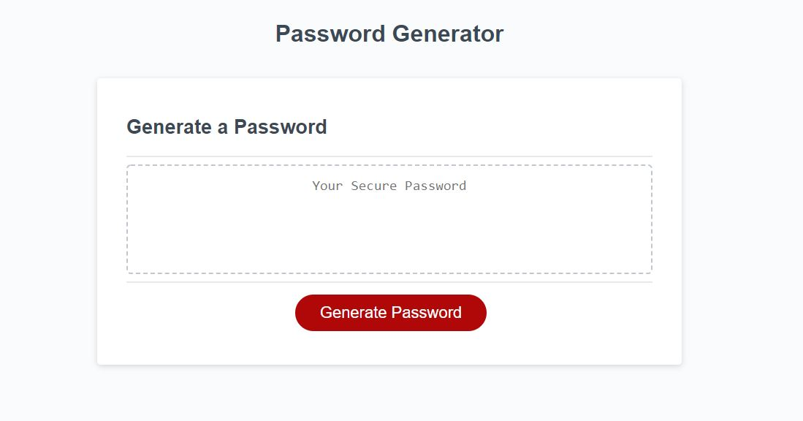
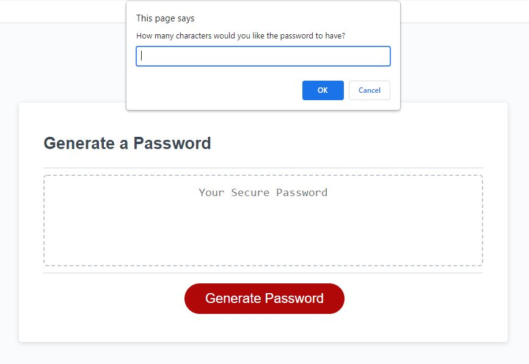
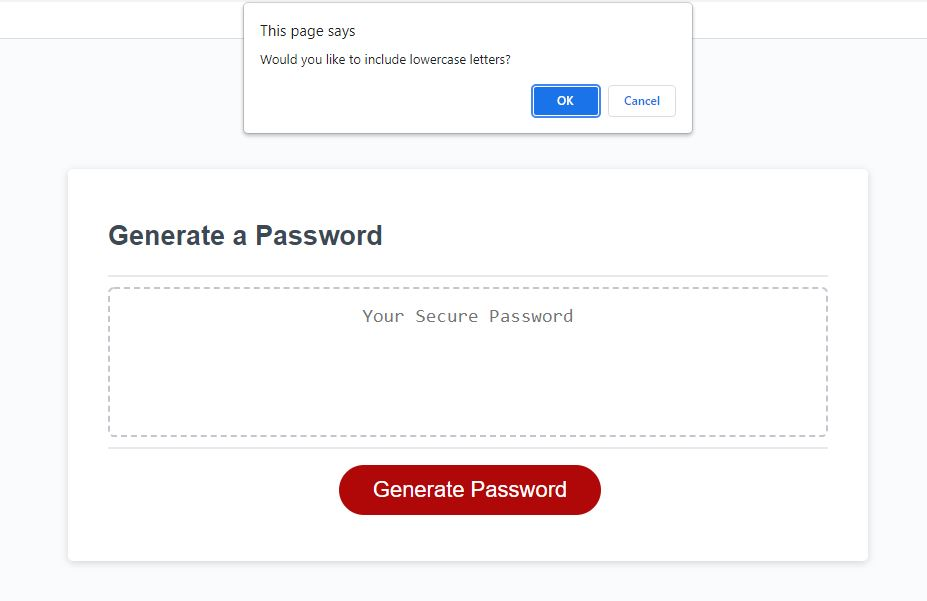
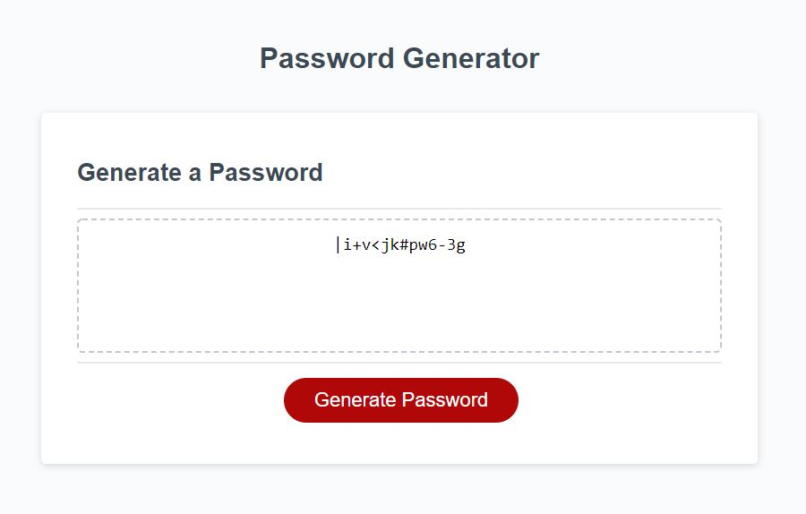

# Welcome to Password-Generator
Providing users with an easy way to generate a password.

## Table of Contents
* Intro
* Password Criteria
* Generating the Password
* Conclusion

## Intro
Welcome to Password Generator. This tool provides users an easy way to generate a password. Users not only can choose how many characters their unique password will contain, they can also choose what type of characters to include in the password. Below is a screenshot the user will see once the website is loaded:

The user will then just simply click the red "Generate Password" to get started.

## Password Criteria
Once the "Generate Password" button is clicked, the user will then be prompted with the following message:

Here the user enters the amount of characters they would like the password to contain. Please note that the user must enter at least 8 characters and no more than 128 characters. If the user enters less than 8 characters, a prompt will display asking the user to please enter a value greater than 8 characters. If the user enters a value greater than 128 characters, a prompt will display asking the user to please enter a value less than 128 characters.

Once the user has entered a valid character amount, we now need to see what type of password the user wants. The following password criteria is presented to the customer:
* Would you like to include lower case letters?
* Would you like to include upper case letters?
* Would you like to include numbers?
* Would you like to include special characters?

These prompts should display to the user like this:

Once the user has selected either yes or no for each criteria, we move on to generating the password.

## Generating the Password
Using the character length and password criteria the user inputting, we use a series of if/else if statements and for loops to find the right criteria and generating an array for the password. Once this is finished, the user will be displayed with their final password. The following image is what the customer will see once the password generation is complete:

## Conclusion
Using Javascript, the password generator website provides an easy way for users to get a safe and secure password with a click of a button. The website offers different criteria depending on what ther user wants their password to contain. If the user does not like the first random password generated, just simply click the red "Generate Password" button and start over to obtain a new password.